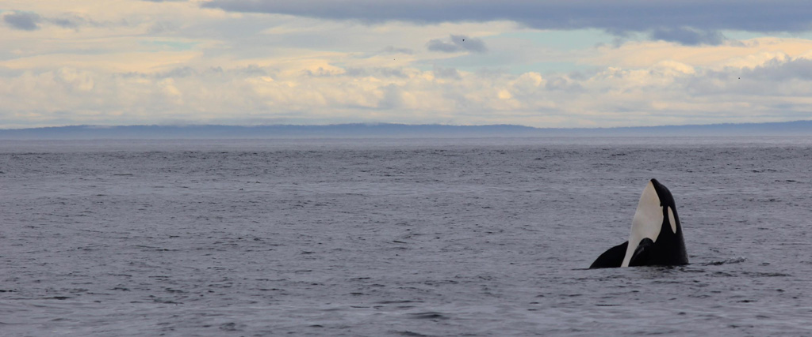

	
<head>
	<title> Odessa Emmanuelle Thompson </title>
	<link href="https://fonts.googleapis.com/css?family=Montserrat:200,400" rel="stylesheet">	
	<link rel="stylesheet" type="text/css" href="main.css">
<head>
	
<header>
	<h1>Odessa Thompson</h1>
	
	
		<nav>
			<ul class="navv">
				<li><h1>Odessa Thompson</h1></li>
				<li></li>
				<li id="plswork"><a href="https://odessathompson.github.io/odessa/"> Home </a></li>
  				<li id="plswork"><a href="https://odessathompson.github.io/odessa_graphics-and-media/">Graphics & Media</a></li>
  				<li id="plswork"><a href="https://odessathompson.github.io/odessa_about/">About</a></li>
  				<li id="plswork"><a href="https://odessathompson.github.io/odessa_resume/">Resume</a></li>
			</ul>
		</nav>
	

</header>
<body>

	
	<h2 style="font-family: 'Montserrat', sans-serif; font-weight: 200;">Intel International Science and Engineering Fair 2018</h2>
	
This year our research team had the amazing honor of being selected to participate in the Intel International Science and Engineering Fair (ISEF) in Pittsburgh, Pennsylvania. Our project was creating a biodegradable algae bioplastic from agar, then testing it in a series of simulated marine ecosystems. We recorded both its biodegradation rate as well as its effect on the water quality levels and organisms. ISEF was an incredible experience and we met students from Portugal to Texas to Sweden.

	
At the regional and state fairs we were awarded:

		

		
Best in Category

		
Best in Class

		
ASU Walton Sustainability Solutions Award

		
Stockholm Junior Water Prize

		
American Meteorological Society

		
Someother Sustainaiblity Award from State

		

	
At Imagine Tomorrow, a Pacific Northwest competetion, we were also recognized with:

		

		
1st Place in the McKinstry Built Environment Challenge

		
Global Impact Award

		

	<h2 style="font-family: 'Montserrat', sans-serif; font-weight: 200;">Whales</h2>
	

